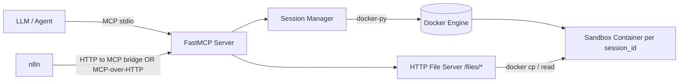

# PRD: Self‑Hosted LLM Python Sandbox (MCP) + Artifact Delivery

## 1) Summary
Build a self-hosted execution service that lets an LLM run Python analysis code safely in an isolated runtime, iterate on errors quickly, and retrieve generated artifacts (plots/reports). The service exposes **MCP tools** (for Claude Code / agents) and **HTTP download URLs** (for n8n / automation).

This PRD derives from two research threads:
- **Research A (Docker/MCP)**: emulate “Code Interpreter” patterns with session containers, `/mnt/data` filesystem, and separate artifact retrieval.
- **Research B (Kubernetes sandbox)**: run in a secure K8s cluster using disposable runtimes with gVisor/Kata, strict NetworkPolicy, and an artifact store.

---

## 2) Goals & Non‑Goals

### Goals
1. **Single-call code execution**: LLM calls `run_python` with code and gets `stdout`, `stderr/traceback`, `exit_code`, and **artifact metadata**.
2. **Sandboxing**: Run untrusted LLM-generated code with strong isolation and tight resource limits.
3. **Artifact handling**: Generated files (PNG/PDF/CSV/HTML/MD) can be:
   - inspected by the LLM (`read_artifact` → base64, size-limited)
   - downloaded by external automation (`download_url`)
4. **Iterative loop**: Fast error feedback, minimal overhead per run.
5. **Self-hosted**: No proprietary dependencies required.

### Non‑Goals (MVP)
- Arbitrary outbound internet access from executed code.
- Full notebook UI (JupyterLab) (optional later).
- Guaranteed persistence of in-memory variables across calls (see §6.2).

---

## 3) Personas & Primary Use Cases

### Personas
- **LLM Agent (Claude Code / similar)**: calls MCP tools, inspects outputs, iterates.
- **Automation Engineer (n8n)**: wants an HTTP endpoint and downloadable artifacts.
- **Platform/Security Engineer**: needs hard isolation, auditability, and control.

### Use Cases
1. **Marketing analysis loop**: upload CSV/XLSX → run analysis → create charts → generate PDF → download PDF.
2. **SQL-to-report** (future): fetch data from warehouse pipeline (e.g., Redshift output) → analyze → publish artifacts.

---

## 4) Success Metrics
- P50 execution latency (warm session): **< 2s** for small scripts (excluding heavy compute).
- Error iteration time: **< 1s** overhead between attempts (not counting Python runtime).
- Artifact retrieval: ability to download or read 100% of generated artifacts reliably.
- Security: network egress from sandboxed code is **denied by default** (verified by tests).
- Operational: automatic cleanup leaves **0 orphaned runtimes** beyond TTL.

---

## 5) Scope

### MVP (Phase 1): Docker Session Sandboxes (fastest path)
- MCP server (FastMCP) managing **one Docker container per `session_id`**.
- `/mnt/data` inside container for files.
- Tools: `upload_file`, `run_python`, `read_artifact`, `close_session`.
- Built-in HTTP file server for `/files/{session_id}/{filename}` (downloads artifacts).
- Resource limits + no outbound network.

### Phase 2: Kubernetes Backend (production hardening)
Add an execution backend that runs inside a K8s cluster:
- Disposable execution via **Job-per-run** OR **Pod-per-session** (decision point; see §13).
- gVisor/Kata via `RuntimeClass`.
- Default-deny NetworkPolicy; allow only artifact store (and DNS if required).
- Artifact store integration (S3-compatible recommended).

---

## 6) Product Requirements

### 6.1 Functional Requirements

#### FR1 — Session model
- Inputs include a `session_id` string.
- The system maps `session_id` → isolated runtime (container/pod/job context).
- Session has **TTL** (idle timeout) and can be explicitly closed.

#### FR2 — Upload data files
- Tool: `upload_file(session_id, filename, content_base64, encoding?)`
- Writes file into runtime at: `/mnt/data/{filename}`
- Returns the absolute path so the LLM can reference it precisely (mirrors “path in prompt context” pattern).

#### FR3 — Execute Python code
- Tool: `run_python(session_id, code, limits?, env?)`
- Executes code in the runtime.
- Returns:
  - `stdout`, `stderr`, `exit_code`
  - `traceback` (optional; may be included in stderr, but field provided for convenience)
  - `artifacts[]` (metadata only) when execution succeeds

#### FR4 — Artifact discovery
- On successful execution, scan `/mnt/data` and return list of files with:
  - `path`, `filename`, `size_bytes`, `mime_type`, `sha256` (optional but recommended)
  - `download_url` (for HTTP consumers)
- On failure, **skip artifact scan** (fail-fast).

#### FR5 — Read artifact content (LLM inspection)
- Tool: `read_artifact(session_id, path)`
- Returns base64 content for small artifacts (configurable max size; e.g., 5–10MB).
- For larger files: return an error with guidance to use `download_url`.

#### FR6 — Close session
- Tool: `close_session(session_id)`
- Destroys runtime and releases resources.

---

### 6.2 Behavior Notes (important for developers)
- **Filesystem state** persists across calls in a session (files in `/mnt/data`).
- **In-memory Python state does not persist** in MVP if each `run_python` starts a new Python process (e.g., `python -c`).  
  If in-memory persistence is required, Phase 2/3 should add a “kernel mode” (Jupyter Kernel Gateway / ipykernel in a long-running process).

---

### 6.3 Non‑Functional Requirements

#### NFR1 — Isolation & security defaults
- No outbound network access from executed code (default).
- Read-only root filesystem when feasible.
- Drop Linux capabilities, no privileged containers, no privilege escalation.
- Strong resource limits:
  - CPU/memory caps
  - max runtime seconds (timeout)
  - max artifact size limits

#### NFR2 — Reliability
- Clear error messages and untruncated tracebacks.
- Orphan cleanup on MCP server restart (label-based discovery).

#### NFR3 — Observability
- Structured logs per run:
  - `session_id`, `run_id`, `exit_code`, duration, resource settings
- Metrics (optional in MVP, required in Phase 2): run counts, failures, timeouts, cleanup stats.

---

## 7) User / Agent Workflows

### 7.1 Claude Code (MCP) workflow
1. `upload_file("sess_123", "sales.csv", <base64>)` → returns `/mnt/data/sales.csv`
2. LLM generates code referencing that exact path.
3. `run_python("sess_123", code)` → returns outputs + artifact list
4. If artifact is an image, LLM calls `read_artifact(...)` to visually verify
5. Iterate until satisfied
6. `close_session("sess_123")`

### 7.2 n8n workflow
1. HTTP → MCP bridge (or MCP over HTTP if enabled)
2. `upload_file` + `run_python`
3. Use `artifacts[].download_url` to fetch PDF/PNG and attach to email/slack/etc.

---

## 8) Tool Contracts (MCP)

### 8.1 `upload_file`
**Input**
| Field | Type | Required | Notes |
|---|---:|---:|---|
| session_id | string | yes | client-defined id |
| filename | string | yes | sanitized server-side |
| content_base64 | string | yes | base64 bytes |
| overwrite | bool | no | default false |

**Output**
```json
{ "path": "/mnt/data/sales.csv" }
```

### 8.2 `run_python`
**Input**
| Field | Type | Required | Notes |
|---|---:|---:|---|
| session_id | string | yes | |
| code | string | yes | Python source |
| limits | object | no | cpu/mem/seconds |
| env | object | no | allowlist-only |

**Output**
```json
{
  "run_id": "run_2026-02-02T12:34:56Z_abcd",
  "exit_code": 0,
  "stdout": "Processed 1500 rows\n",
  "stderr": "",
  "traceback": null,
  "artifacts": [
    {
      "path": "/mnt/data/report.pdf",
      "filename": "report.pdf",
      "size_bytes": 120000,
      "mime_type": "application/pdf",
      "download_url": "http://<host>:8080/files/sess_123/report.pdf"
    }
  ]
}
```

### 8.3 `read_artifact`
**Input**: `session_id`, `path`  
**Output**
```json
{
  "path": "/mnt/data/chart.png",
  "mime_type": "image/png",
  "content_base64": "<...>"
}
```

### 8.4 `close_session`
**Output**
```json
{ "status": "closed" }
```

---

## 9) Architecture

### 9.1 Phase 1 (Docker): reference design


**Key implementation points**
- Containers labeled with `app=llm-sandbox` and `session_id=...`
- `/mnt/data` as working directory
- Container network disabled (`--network none`) unless Phase 2 requires internal artifact store access
- Limits enforced at container creation + exec timeout enforced at tool layer

### 9.2 Phase 2 (Kubernetes): backend swap
Introduce an abstraction:
- `ExecutionBackend` interface: `ensure_session()`, `run_code()`, `put_file()`, `get_file()`, `close_session()`
- Implementations:
  - `DockerBackend` (Phase 1)
  - `K8sBackend` (Phase 2)

K8s hardening (from research):
- `runtimeClassName: kata` or `gvisor`
- `allowPrivilegeEscalation: false`
- `readOnlyRootFilesystem: true` (where feasible)
- drop all capabilities, seccomp/apparmor
- default-deny egress NetworkPolicy; allow only artifact store + DNS (optional)

---

## 10) Security Requirements (MVP + Phase 2)
- **Path traversal protection**: prevent `../` in filename/path for upload/read.
- **Session isolation**: session_id cannot access other sessions’ files.
- **Artifact server auth (optional)**:
  - MVP: internal-only, or signed URLs (Phase 2)
- **Package installation**:
  - MVP: disabled (fixed image).
  - Phase 2 option: allow only via internal proxy/allowlisted index (similar to OpenAI proxy model).

---

## 11) Deployment

### Phase 1
- Docker Compose bundle:
  - `mcp-server` (FastMCP tool server)
  - optional: same container also runs HTTP file server on `:8080`
- Requires Docker socket access if MCP server runs in container.

### Phase 2
- Helm chart:
  - `mcp-server` Deployment (control plane)
  - RBAC to create Jobs/Pods
  - NetworkPolicy + RuntimeClass
  - Artifact store config (S3-compatible)

---

## 12) Risks & Mitigations
- **Sandbox escape risk**: container boundary alone may be insufficient → Phase 2 adopts gVisor/Kata + stricter policies.
- **State expectations mismatch**: users assume variables persist across calls → document clearly; add kernel-mode later.
- **Large artifacts**: base64 responses too large → size limits + HTTP download URLs.
- **Cold start** (K8s job-per-run): mitigate with pre-pulled images and node caching.

---

## 13) Open Decisions (must confirm)
1. **Transport**: MCP stdio only vs also Streamable HTTP for MCP calls.
2. **K8s execution pattern**:
   - A) Job-per-run (strong isolation, stateless)
   - B) Pod-per-session (stateful filesystem, closer to “Code Interpreter”)
3. Artifact download security: internal-only vs signed URLs vs token auth.

---

## 14) Milestones
- **M0 (Design freeze)**: tool schemas, security defaults, artifact limits.
- **M1 (Docker MVP)**: tools implemented + local demo with CSV→PNG/PDF.
- **M2 (Hardening)**: limits, cleanup, logging, tests, docs.
- **M3 (K8s backend)**: runtimeclass + networkpolicy + artifact store integration.

---

# Derived Engineering Tasks & Tickets

## Epic E1 — MCP Server Core (FastMCP)
### T1.1 — Project scaffolding + FastMCP server
**Description**: Create Python service with FastMCP exposing tool stubs and JSON schemas.  
**Acceptance Criteria**
- `mcp.run()` starts successfully
- Tools appear with correct input/output schemas

### T1.2 — Implement session manager
**Description**: Map `session_id` → runtime handle; TTL cleanup; orphan cleanup by label.  
**Acceptance Criteria**
- Idle sessions removed after configured TTL
- On restart, server cleans containers with `app=llm-sandbox` older than TTL

### T1.3 — Implement `run_python`
**Description**: Execute code with timeout; capture stdout/stderr/exit_code; generate run_id.  
**Acceptance Criteria**
- Returns full stderr with traceback on exception
- Enforces timeout and returns structured timeout error

---

## Epic E2 — Docker Execution Backend (MVP)
### T2.1 — Build sandbox Docker image
**Description**: Create pinned image with scientific stack (pandas/numpy/matplotlib/seaborn/openpyxl/pyarrow/reportlab).  
**Acceptance Criteria**
- Image builds reproducibly
- Simple script can generate PNG + PDF into `/mnt/data`

### T2.2 — Container creation with resource limits + no network
**Description**: Create containers per session with CPU/mem limits and network disabled.  
**Acceptance Criteria**
- Attempted outbound network call from Python fails
- CPU/memory limits configurable via env

### T2.3 — Filesystem conventions
**Description**: Ensure `/mnt/data` exists, is writable, and is the working dir for runs.  
**Acceptance Criteria**
- Upload then read works; code can reliably access `/mnt/data/<filename>`

---

## Epic E3 — File Upload & Artifact Handling
### T3.1 — Implement `upload_file`
**Description**: Accept base64 file content and write into container via `put_archive`.  
**Acceptance Criteria**
- Upload of CSV/XLSX works
- Filename sanitized; path traversal blocked

### T3.2 — Implement artifact scanning
**Description**: On successful run, scan `/mnt/data` and return metadata (size/mime/filename/path).  
**Acceptance Criteria**
- Artifacts list includes new files created by run
- Skips scan on non-zero exit_code

### T3.3 — Implement `read_artifact` with size limits
**Description**: Read file bytes from container and return base64 if <= configured max.  
**Acceptance Criteria**
- PNG under limit returns base64
- PDF over limit returns deterministic error and suggests download_url

---

## Epic E4 — HTTP Artifact Download Server
### T4.1 — Implement `/files/{session_id}/{filename}` endpoint
**Description**: Serve artifact bytes with correct Content-Type.  
**Acceptance Criteria**
- Download URL in `run_python` artifacts works end-to-end
- 404 for missing session/file; 403 for session mismatch if applicable

### T4.2 — Optional auth / signed URLs (Phase 2 candidate)
**Description**: Add token-based protection or signed URL generation.  
**Acceptance Criteria**
- Downloads require valid token OR URL signature validates

---

## Epic E5 — Security Hardening & Guardrails
### T5.1 — Input validation & allowlists
**Description**: Validate session_id format, filename/path rules, env allowlist.  
**Acceptance Criteria**
- `../` blocked
- Only allowlisted env keys are passed into runtime

### T5.2 — Execution limits
**Description**: Enforce max code length, max output size (stdout/stderr), max artifacts count.  
**Acceptance Criteria**
- Excessive output is truncated with explicit `"truncated": true` metadata

---

## Epic E6 — Observability & Ops
### T6.1 — Structured logging
**Description**: Emit JSON logs for every tool call and run.  
**Acceptance Criteria**
- Each `run_python` log includes session_id, run_id, duration_ms, exit_code

### T6.2 — Health endpoints (if HTTP enabled)
**Description**: `/healthz` and `/readyz`.  
**Acceptance Criteria**
- Returns 200 when server ready; includes backend status

---

## Epic E7 — Tests & CI/CD
### T7.1 — Unit tests (validation, path safety, schema)
**Acceptance Criteria**
- Coverage for sanitization and schema generation

### T7.2 — Integration tests (Docker)
**Acceptance Criteria**
- Test: upload CSV → run code → artifact PNG discovered → read_artifact returns base64
- Test: outbound network attempt fails

### T7.3 — CI pipeline
**Acceptance Criteria**
- Lint + tests on PR
- Build/publish docker images with pinned deps

---

## Epic E8 — Kubernetes Backend (Phase 2)
### T8.1 — ExecutionBackend abstraction
**Acceptance Criteria**
- DockerBackend remains functional; interface supports adding K8sBackend

### T8.2 — K8s Job-per-run prototype
**Acceptance Criteria**
- `run_python` executes via Job, collects logs, uploads artifacts to store, returns artifact refs

### T8.3 — RuntimeClass + NetworkPolicy hardening
**Acceptance Criteria**
- Pods run under gVisor/Kata (validated)
- Default deny egress enforced

### T8.4 — Helm chart + RBAC
**Acceptance Criteria**
- Deployable into namespace with least-privilege RBAC for Jobs/Pods

---

## Epic E9 — Documentation & Examples
### T9.1 — Developer docs
**Acceptance Criteria**
- README: local run, tool examples, security model, limits

### T9.2 — Example workflows
**Acceptance Criteria**
- Example script for marketing CSV → chart → PDF
- Example n8n flow using download_url